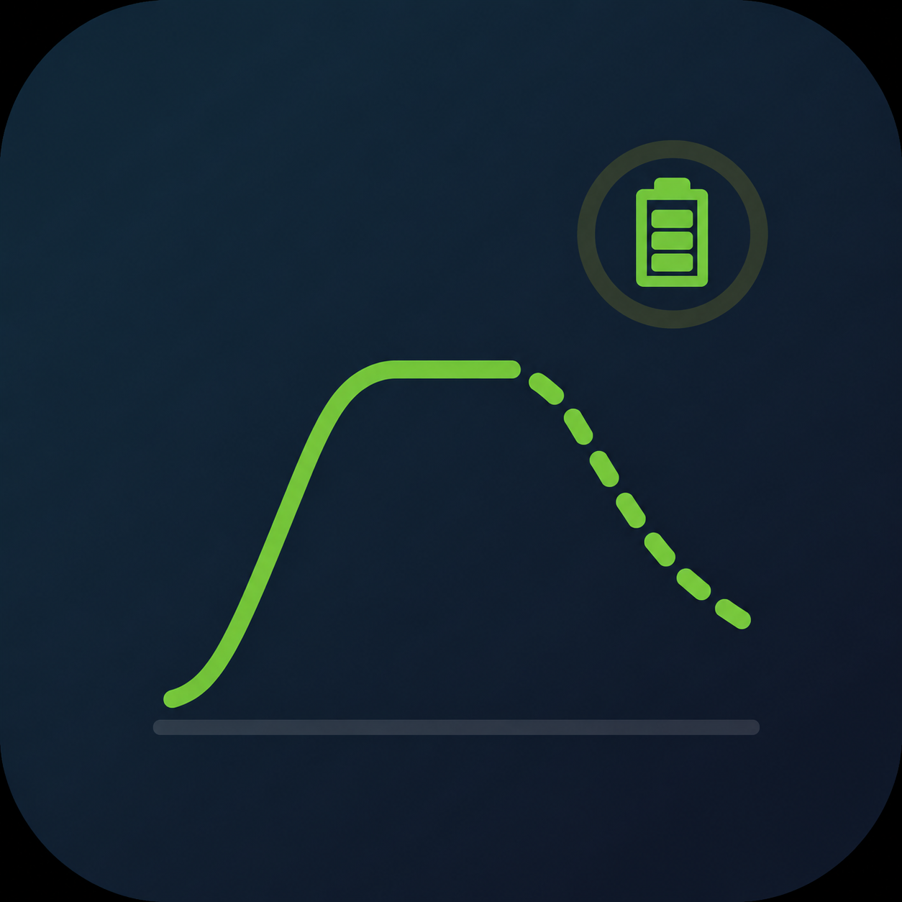

# Battery Forecast for Home Assistant Charts

<p align="center">
  
</p>

Home Assistant custom integration that forecasts the Battery SOC from your photovoltaik/solar system based on the usage. Used for nice charts where you can see how long the battery will last with the current energy consumption.

[](https://my.home-assistant.io/redirect/hacs_repository/?owner=wolpa29&repository=homeassistant-battery-forecast&category=integration)

## Configuration

Two modes are available:

- **Linear Mode** (default): forecasts based on current charge/discharge power
- **Advanced Mode**: uses PV forecast and grid load data for accurate simulation (requires [pv_forecast_planner](https://github.com/wolpa29/pv_forecast_planner))

Configure entities and select your mode during setup via Settings -> Devices & Services -> Add Integration.

## Debug Logging

To see detailed logs for troubleshooting, add this to your `configuration.yaml`:

```yaml
logger:
  default: info
  logs:
    custom_components.battery_soc_forecast.sensor: debug
    custom_components.battery_soc_forecast.config_flow: debug
```

Restart Home Assistant after adding the logger configuration.

## Sensor Attributes

The sensor exposes forecast data as attributes: `forecast`, `empty_at`, `full_at`, `remaining_time`, `mode`.

## Old pyscript version

My original pyscript implementation is archived in `archive/pyscript_main.py`.